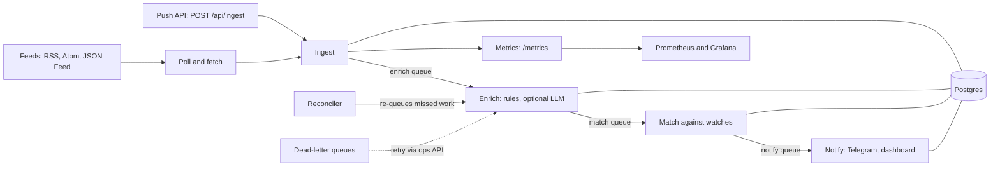

# feedhound

Keyword watcher for public feeds, with Telegram alerts.

<!-- screenshot.png -->

## Why

I wanted to know when a specific thing shows up in a feed without refreshing
pages all day. Existing feed readers filter poorly and alert tools are tied to
one site. feedhound polls feeds you choose, matches new posts against watches
you write, and sends the hits to Telegram.

## Features

- Sources: RSS, Atom and JSON Feed URLs, plus a push API (`POST /api/ingest`) for your own scripts.
- Watches with include terms, exclude terms, regex, price range and buy/sell intent.
- Matches inbox in the dashboard, updated live over WebSocket.
- Telegram alerts, plus a bot with `/watch` and `/search` commands.
- Optional LLM enrichment through any OpenAI-compatible endpoint. Without it, rules only.
- Dashboard for sources, watches, matches, API keys, config and ops views.
- Fetcher that checks robots.txt, blocks private addresses (SSRF guard) and limits request rate, size and time.
- Prometheus metrics, health endpoints and collection SLO gauges.

## Architecture



Jobs run on pg-boss queues stored in the same Postgres database. A reconciler
re-queues posts that missed a stage, and jobs that keep failing land in
dead-letter queues that can be retried through the ops API. Services:
`api` (HTTP and WebSocket), `agent` (workers), `bot` (Telegram long polling),
`web` (dashboard, also proxies `/api` and `/ws`).

## 60-second demo

Requires Docker with the Compose plugin.

```bash
git clone https://github.com/mqa8668/feedhound.git && cd feedhound
cp .env.example .env          # set POSTGRES_PASSWORD
docker compose --profile demo up -d --build
```

Open http://127.0.0.1:4823 and log in with the password `demo`. The first
build takes a few minutes; after the agent starts, the demo watches begin
matching the fixture feeds and hits appear on the Matches page. No Telegram
bot is needed for that.

The password `demo` is for the demo only. When `AUTH_PASSWORD_HASH` is unset,
`docker-compose.yml` falls back to a hash of `demo`, and the api refuses that
hash outside the demo setup. Set your own hash before using real data (see Auth).

The demo seeds an RSS deals feed, an Atom homelab feed, a JSON Feed at
`/news.json` (add it from the dashboard to try the format), one internet feed
(`https://hnrss.org/newest?q=self-hosted`) and three watches. It also sets
`web.allowPrivateHosts=true`, because the fixture server is a compose-internal
host. Leave that `false` anywhere else.

With no internet, run `DEMO_OFFLINE=1 docker compose --profile demo up -d --build`
to skip the hnrss.org feed (images must already be built or pulled). Stop and
delete demo data with `docker compose --profile demo down -v`. Re-seed with
`bun run db:seed:demo` (idempotent).

| Service | Purpose | Host port |
|---|---|---|
| postgres | database | 5433 |
| migrate | one-shot: migrations and base seed | - |
| api | HTTP API and WebSocket | 4820 |
| agent | workers: poll, enrich, match, notify | 4821 |
| web | dashboard | 4823 |
| bot | `telegram` profile | 4822 |
| demo-feeds, demo-seed | `demo` profile | - |
| prometheus, grafana | `metrics` profile | 4830, 4831 |

Override a taken port in `.env` with `PG_PUBLISH`, `API_PUBLISH`, `AGENT_PUBLISH`,
`BOT_PUBLISH` or `WEB_PUBLISH`.

## Configuration

Environment variables (see `.env.example` for the full list and comments):

| Variable | Purpose |
|---|---|
| `POSTGRES_PASSWORD` | Required by compose. |
| `DATABASE_URL`, `TEST_DATABASE_URL` | Dev and test databases. Tests refuse a name not ending in `_test`. |
| `AUTH_MODE` | `local` (default) or `cf-access`. |
| `AUTH_PASSWORD_HASH`, `SESSION_SECRET` | Local login hash and cookie signing key. |
| `PUBLIC_URL`, `PUBLIC_HOSTNAME` | Public address when exposed; see Auth safety checks. |
| `CF_ACCESS_AUD`, `CF_ACCESS_TEAM_DOMAIN` | Cloudflare Access mode. |
| `TG_BOT_TOKEN`, `TG_API_BASE` | Telegram bot token and optional API base override. |
| `LLM_BASE_URL`, `LLM_API_KEY`, `LLM_MODEL_CHEAP`, `LLM_MODEL_STRONG` | Optional LLM enrichment. |
| `DEMO_OFFLINE` | `1` skips the hnrss.org demo feed. |
| `LOG_LEVEL`, `NODE_ENV`, `IMAGE_TAG`, `MEDIA_DIR` | Runtime settings. |
| `OPS_API_KEY`, `R2_*` | Backup failure notification and optional offsite copy. |
| `*_PORT`, `*_PUBLISH` | Container and host ports. |

Runtime settings live in the Config table, seeded from `config/defaults.yaml`
and editable through the Config page or `/api/config`. Common keys:

| Key | Default | Meaning |
|---|---|---|
| `web.enabled` | `false` | Turns on feed polling. |
| `web.pollIntervalSec` | `600` | Poll cadence. |
| `web.minRequestGapMs` | `5000` | Minimum gap between requests to one host. |
| `web.allowPrivateHosts` | `false` | Disables the private-address guard. Demo only. |
| `web.userAgent` | `feedhound/0.1 (...)` | User-Agent sent to feeds. |
| `match.minScore` | `0.5` | Minimum match score. |
| `notify.quietHoursStart`, `notify.quietHoursEnd` | `22:00`, `07:00` | Quiet hours. |
| `notify.rateLimit.perChatPerMin` | `20` | Telegram send limit per chat. |
| `llm.dailyTokenBudget` | `2000000` | Daily LLM token cap. |
| `app.tz` | `Asia/Ho_Chi_Minh` | Time zone for schedules and digests. |

## Adding feeds

**Dashboard.** Sources, "Add feed source", paste an RSS, Atom or JSON Feed URL,
press Preview. The server fetches the URL once under the usual limits and shows
the latest five items, or a readable reason (HTML page, unreachable, blocked,
too large). Add saves it; the agent polls it on its next run (needs
`web.enabled`). The API equivalents are `POST /api/sources/preview` and
`POST /api/sources` with `{"url": ..., "name": ...}`. Adding the same feed
twice returns 409.

**CLI.**

```bash
bun run --cwd apps/agent web:source-add --connector feed \
  --url https://example.com/feed.xml --name "Example blog"
```

**Push API.** Create an ingest key on the Keys page and assign it to a source.
`sourceId` comes from `GET /api/sources`; `visitId` is any string you pick.

```bash
curl -X POST http://127.0.0.1:4820/api/ingest \
  -H "Authorization: Bearer <key>" \
  -H "Content-Type: application/json" \
  -d '{
    "sourceId": "<source uuid>",
    "visitId": "manual-1",
    "posts": [{
      "platformPostId": "kb-1",
      "url": "https://example.com/posts/kb-1",
      "text": "Selling a mechanical keyboard, barely used",
      "media": [],
      "capturedAt": "2026-10-08T09:00:00Z"
    }]
  }'
# {"accepted":1,"duplicates":0,"updated":0}
```

Bodies are capped at 5 MB. The request is exercised in
`apps/api/src/routes/ingest-readme.test.ts`.

## Telegram setup

1. Create a bot with BotFather and copy the token.
2. Put it in `.env` as `TG_BOT_TOKEN`.
3. Start the bot: `docker compose --profile telegram up -d`.
4. Generate a link code for your dashboard user:
   `bun run --cwd apps/bot link-code <email>` (needs `DATABASE_URL`).
5. Send `/link <code>` to the bot. Codes expire after 24 hours.

Commands: `/start`, `/status`, `/link <code>`, `/search <q> [-n 1..10]`,
`/watch add <name> [-i term] [-a term] [-x term] [-r regex] [-c category] [-p min-max] [--intent sell|buy]`,
`/watch list`, `/watch del <sel>`, `/watch mute <sel> [30m|2h|1d|off]`.
Without `TG_BOT_TOKEN` everything else runs and no Telegram message is sent.

## Auth modes

**Local (default).** One operator signs in at `/login` with a password and gets
a signed session cookie. Generate the hash:

```bash
bun -e 'console.log(await Bun.password.hash("your-password"))'
```

Put it in `.env` as `AUTH_PASSWORD_HASH='...'` (single quotes keep the `$`
characters) and set `SESSION_SECRET` to a long random string. Login attempts
are rate limited.

**Cloudflare Access (optional).** Set `AUTH_MODE=cf-access`, `CF_ACCESS_AUD`
and `CF_ACCESS_TEAM_DOMAIN`; the api validates the Access JWT on every route.

Safety checks at startup: in production, local mode refuses to start without a
password hash (unless `AUTH_ALLOW_NO_PASSWORD` is set for loopback-only use),
refuses a non-loopback `PUBLIC_URL` or `PUBLIC_HOSTNAME` unless
`AUTH_MODE_LOCAL_I_KNOW=1`, and refuses `DEV_AUTH_BYPASS=1` together with
production or Access mode. `X-Dev-User` is a dev and test bypass only and is
never honoured in production.

## Security notes

- SSRF guard: hosts are resolved and every address is checked against loopback, private, link-local, CGNAT, multicast and cloud metadata ranges (IPv4 and IPv6, including mapped forms). The connection is then pinned to the validated address, so a later DNS answer cannot redirect it. Redirects are followed manually, at most 3, and each hop is checked again.
- robots.txt is fetched and honoured before any feed request.
- Per-host gap between requests (`web.minRequestGapMs`), a descriptive User-Agent, no cookies, 15 second timeout, 2 MB body cap.
- Rate limits on login and on API-key routes.
- API responses are masked for PII (phone numbers and similar) before they leave the process.
- feedhound never logs in to third-party sites.
- All compose ports are bound to 127.0.0.1.

Report vulnerabilities as described in `SECURITY.md`.

## Observability

- `GET /healthz` (liveness) and `GET /readyz` (readiness) on api, agent and bot; `/healthz` on web.
- `GET /metrics` in Prometheus text format on api, agent and bot. It is unauthenticated, so keep it off the public internet.
- `docker compose --profile metrics up -d` starts Prometheus (4830) and Grafana (4831) with a scrape config for the three services.
- SLO gauges, computed over a rolling 24 hours: per-source coverage target 98% of expected visits ok and 95% complete.
- `infra/backup.sh` writes a `pg_dump` with free-space and checksum checks and can copy it to R2; `infra/restore.sh <dump|latest>` restores into a scratch database and can swap it in with `--swap`.

## Languages and currency

The dashboard, the bot and every notification are in English. Matching
(keyword, regex, exclude) is language-agnostic. Price parsing understands VND
shorthand only, for example `15tr` or `1.2 ty`; a configurable currency is on
the roadmap.

Two defaults depend on the language of the posts you collect. Each has a preset
key (`en`, `vi` or `none`) plus an explicit list added on top:

| Preset key (default `en`) | Extra list (default empty) | What it does |
|---|---|---|
| `match.weakTermsPreset` | `match.weakTerms` | Generic low-signal words that never count as product evidence. `en`: for sale, selling, wanted, buy, price, offer, new, used, cheap, contact, pm, dm, obo, shipping. `vi`: a Vietnamese list. |
| `watch.suggestExcludePreset` | `watch.suggestExcludeSell` | Exclusions suggested for "for sale" watches so buyers posing as sellers stay out. `en`: wtb, want to buy, looking to buy, looking for. `vi`: Vietnamese phrases. |

Set a preset to `none` to use only your own list. For Vietnamese posts, set
both presets to `vi` on the Config page or in `config/defaults.yaml` before seeding.

## Development

```bash
bun install
cp .env.example .env   # fill in DATABASE_URL and TEST_DATABASE_URL
docker compose up -d postgres
bun run db:migrate
bun run db:seed
bun run dev
```

The test database name must end in `_test`; test code refuses anything else.

| Script | What it does |
|---|---|
| `bun run dev` | run all apps |
| `bun run typecheck` | typecheck all workspaces |
| `bun run lint` | lint |
| `bun run test` | backend tests, then web tests |
| `bun run test:e2e` | browser tests for the web app |
| `bun run db:migrate` | apply migrations |
| `bun run db:seed` | seed taxonomy, config defaults, operator user |
| `bun run db:seed:demo` | add demo sources, watches and config |
| `scripts/check-forbidden-words.sh` | vocabulary check run in CI |

See `CONTRIBUTING.md` for adding a connector.

## Roadmap

- Telegram channel source through the Bot API.
- Reddit OAuth source (Reddit's robots.txt blocks anonymous feed access).
- Configurable currency for price parsing.
- Generic webhook notifier.

## Status

Built for my own use and shared as is. Issues are welcome; there is no SLA.

## License

MIT. See `LICENSE`.
